# 나랑, 사귈래?


## 팀소개
😂 | 🐙 | 🐋 | 🤑 |
---|---|---|---
권채훈 | 김정은 | 전상민 | 이예나
커플앱? 그건, 숙제와 같았죠. 하지만 이건 달라요. | 이미 마음속으로 사용 중.. ❤️ | 이전에 봤었던 어플은 전부 별로였어요. 그래서, 만들었습니다. | 장담컨데, 최고라고 자신할 수 있습니다.

## 개요
#### **추진 배경 및 목적**
  > DB설계 과제의 목적을 띄고있기 때문에 프로그램 구현 보다 추후 서비스의 성장을 위한 **DB확장성과 서버의 간결함**을 보다 중요하게 생각하며 DB설계를 진행하였습니다.

##### **고객층 및 기대효과**
  > 실제 서비스를 사용할 예정인 사람들은, 연인 관계인 사용자
  하지만, 이 서비스를 보며 **판단하고 평가할 사람들은 여기있는 청중들이라고 판단**하여 보다 **즐겁게 보실 수 있도록 주제를 선정**하고 그에 맞게 자료를 팀원들과 함께 제작했습니다.

## 프로젝트 소개
```
❤️❤️❤️
나, 너랑 평생 하고싶어서 만들었어...
널 위한 프로젝트야..

Forever with you...❤️
```

## 프로젝트 필요성
```
두 사람 ❤️ 사이에
둘만 공유하는 무언가가 있으면
둘 간의 관계는 점점 특별해 집니다.
둘만의 사진, 둘 만의 대화.
둘만의 기념일과 일정
그래서 둘 만의
앱
```

<details>
  <summary>CASE 1 :: 특별한 공간</summary>

  <br>

  > 연인과 나만의 특별한 공간이 필요하신가요?!
  > 다른 사람들은 절대 숨어서, 훔쳐볼 수 없는 특별한 공간! 지금 경험해보세요.

  - 나, **너.랑.만** 있고싶어! 😚😚
  
    
  - 아잇참~ 😍😍
  
</details>


<details>
  <summary>CASE 2 :: 깜빡한 D-DAY!!</summary>
  
  <br>


  > 중요한 날을 잊어버렸을 때, 화난 애인의 모습?!
  > 잊지 않도록, 사소한 일정도 등록할 수 있도록 도와드립니다!
  - 우리 처음 만난 날 기억해?
  - 어... 그게... ``이 시점에서 이미 큰일``
</details>

<details>
  <summary>CASE 3 :: Olivia 愛してる...🤐</summary>
  
  <br>

  
  > 한국에 거주하는 외국인들에게! 딱 맞는 어플
  > 세계로 뻗어가는 대한민국! 글로벌 서비스도 함께 제공합니다!
  - Hey Takeshi Kun.. 😢
  - Olivia 愛してる...🤐
</details>


---

<details>
  <summary>CASE ⭐ :: 안녕, 내 사랑...💔</summary>
  
  <br>

  만남이 있으면 헤어짐도 있는 법.

  슬픈 그 순간, 한번에 지워드립니다.
# 그만, 만나자..


그 사람과 함께했던 ``순간``, ``온도``, ``습도``.. 일정과 앨범이 다 남아있어요. 볼 때 마다 너무 괴로워요..
> 커플이 해제되면, 따로 작업할 필요없이 그 사람과 있던 추억.
> 
> 전부 삭제되도록 도와드립니다.
> 
</details>


## 자료
#### 요구사항정의서 
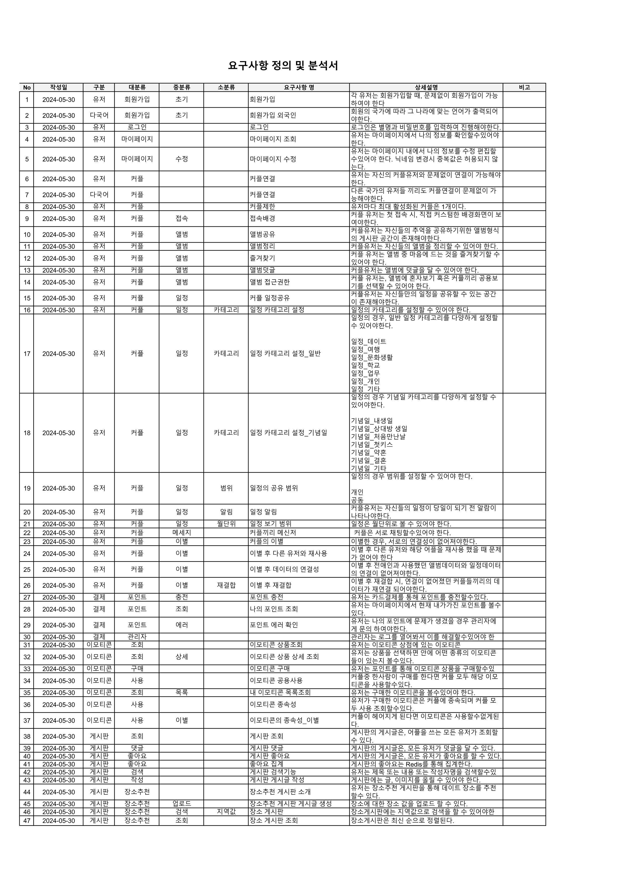

[이동](https://docs.google.com/spreadsheets/d/1v9d_2rAcA2dAaF9P8p0xJnWoJbT_aba97_CIL29OBaI/edit#gid=624231462)

#### WBS
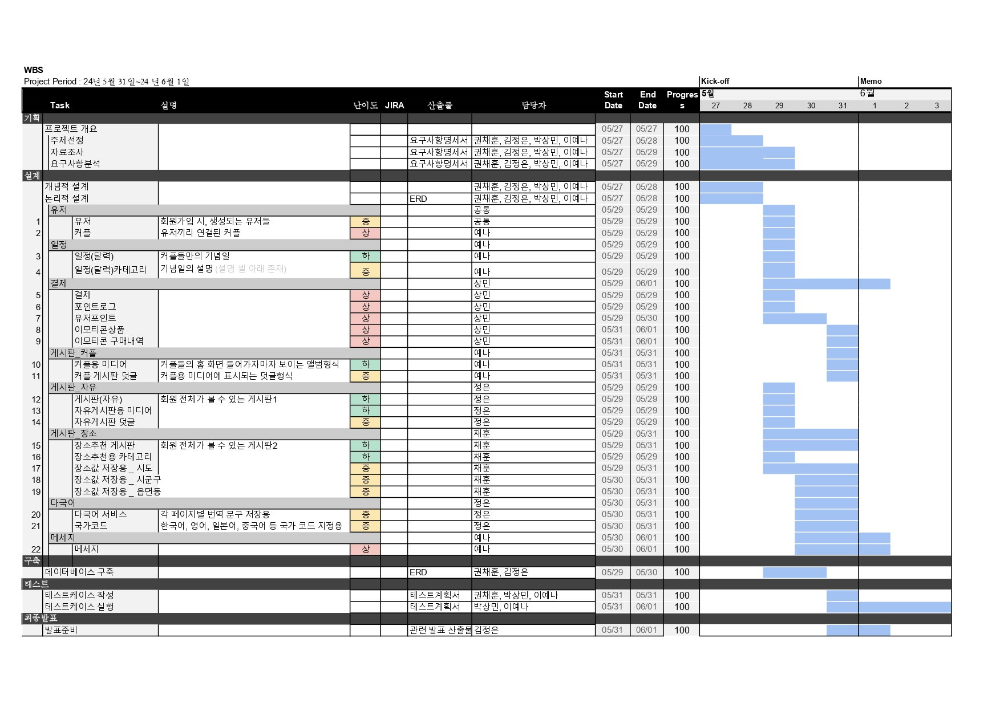

#### JIRA
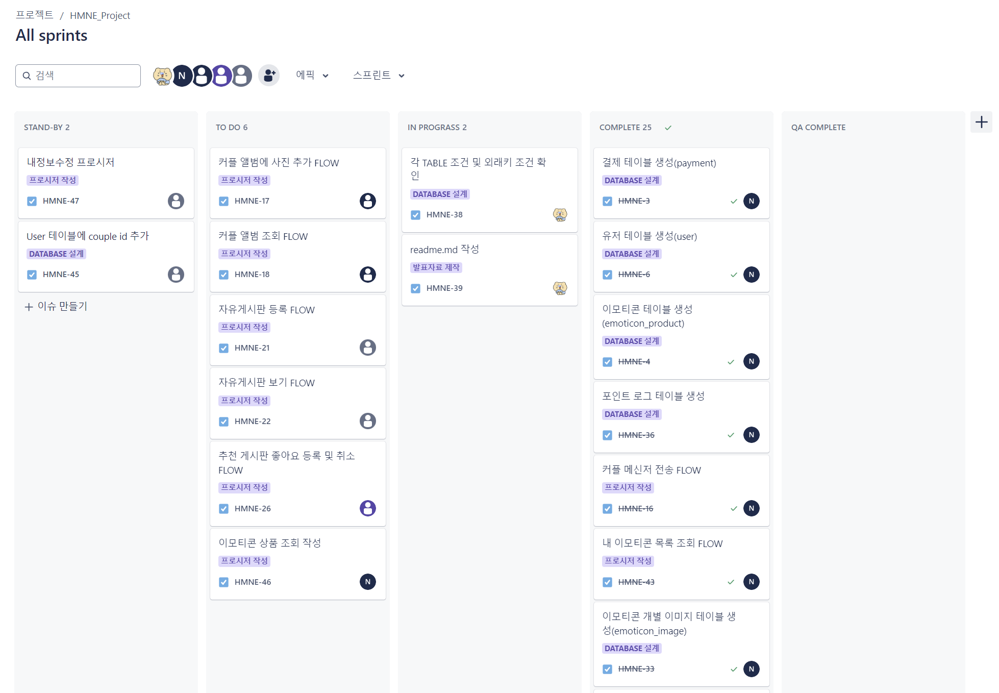

[JIRA 프로젝트 페이지](https://kje0521.atlassian.net/jira/software/projects/HMNE/boards/2)

#### 유저플로우
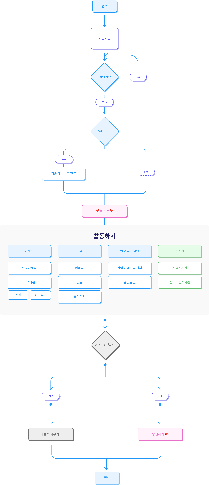


#### 개념적 ERD


#### 논리적 ERD


[ERD 최종](https://www.erdcloud.com/d/3H3cHrnrM8FnEpsfP)

#### 프로시저
<details>
  <summary>회원가입</summary>

  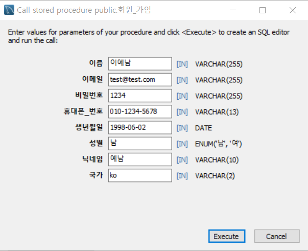

  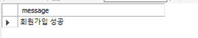

    
</details>
<details>
  <summary>로그인</summary>

  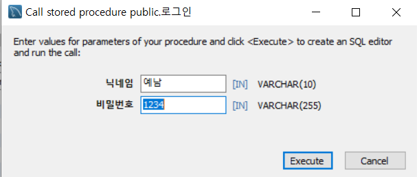
  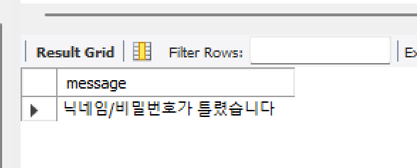
  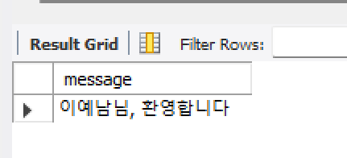
  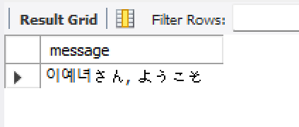
</details>

<details>
  <summary>나랑사귀자</summary>

  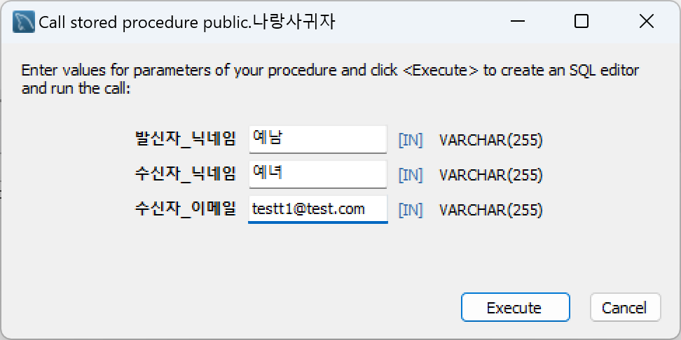

  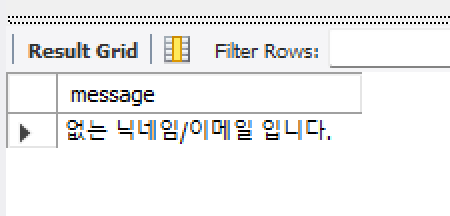

  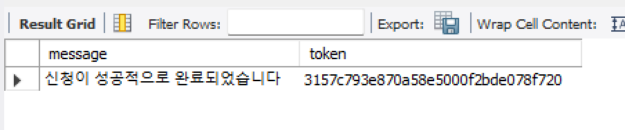
</details>
<details>
  <summary>그래사귀자</summary>

  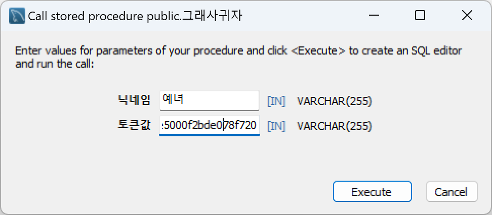

  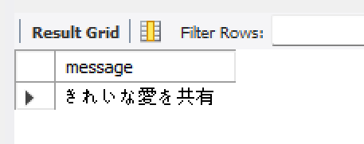

  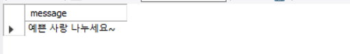

</details>


<details>
  <summary>내정보수정</summary>

  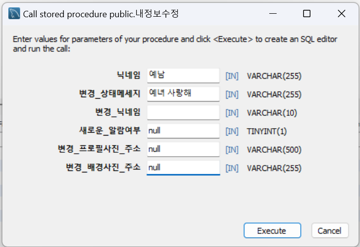

  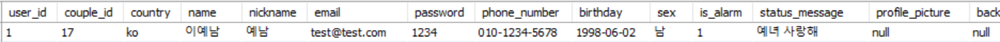
</details>

<details>
  <summary>너와_나의_연결고리</summary>

  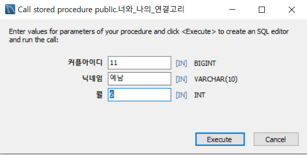

  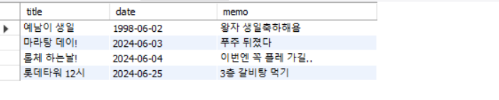

</details>

<details>
  <summary>마이페이지조회</summary>

  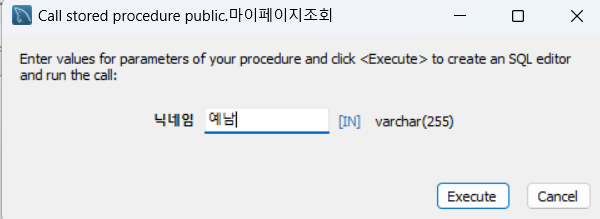

  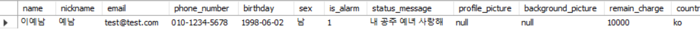
</details>


</details>

<details>
  <summary>우리의_추억보기</summary>

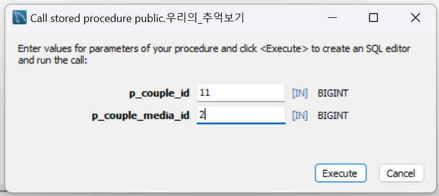

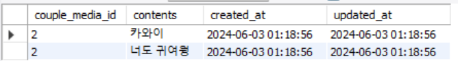
  
</details>

<details>
  <summary>메세지보내기</summary>

  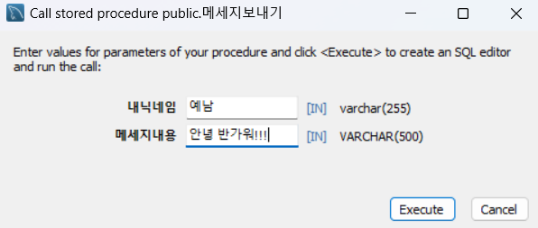

  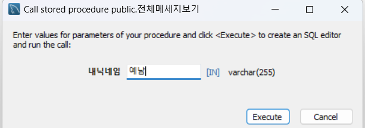

  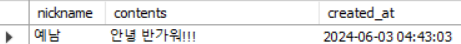
</details>

<details>
  <summary>전체메세지보기</summary>

  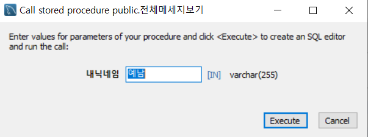
  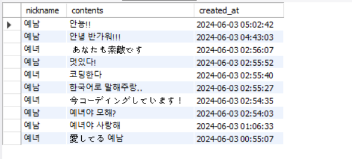
</details>

<details>
  <summary>포인트충전</summary>
  
  
  
  

</details>

<details>
  <summary>이모티콘상점목록조회</summary>

  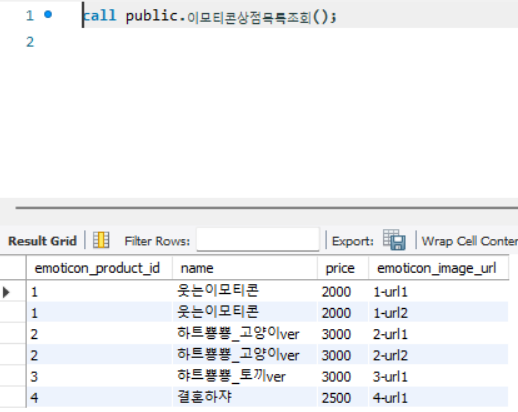

</details>

<details>
  <summary>이모티콘구매</summary>

  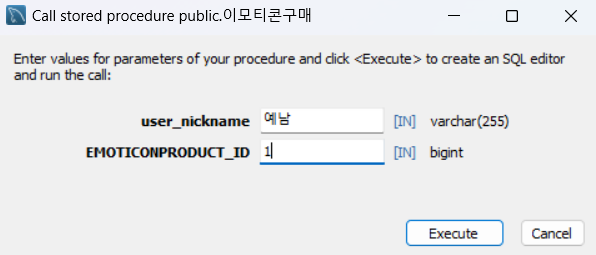
</details>

<details>
  <summary>내이모티콘조회</summary>

  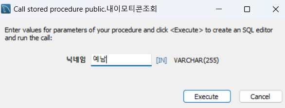

  
</details>

<details>
  <summary>게시글검색</summary>
  키워드로 검색

  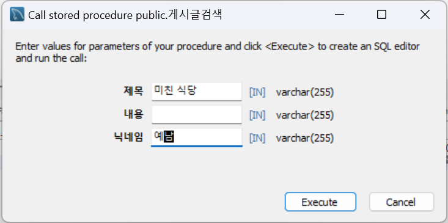

</details>

<details>
  <summary>게시글조회</summary>

  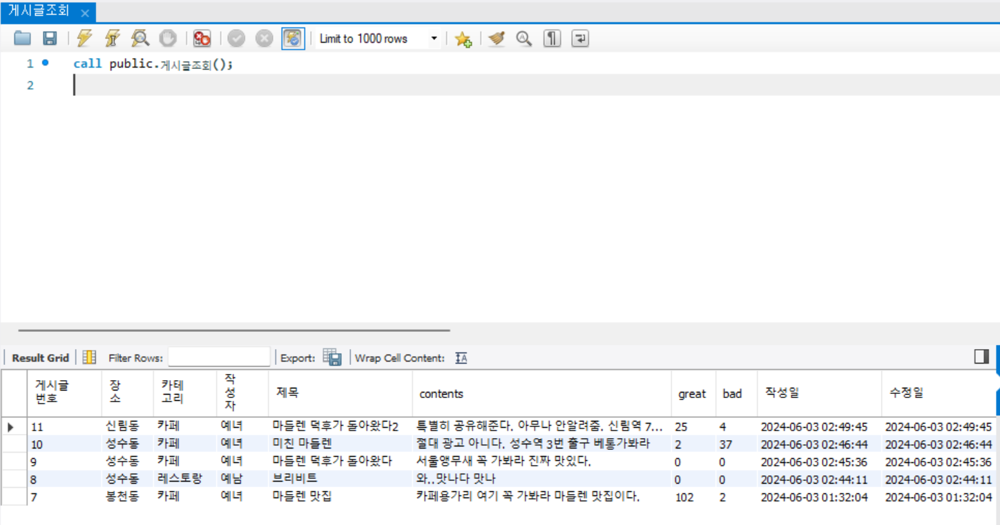
</details>

<details>
  <summary>게시글만들기</summary>

  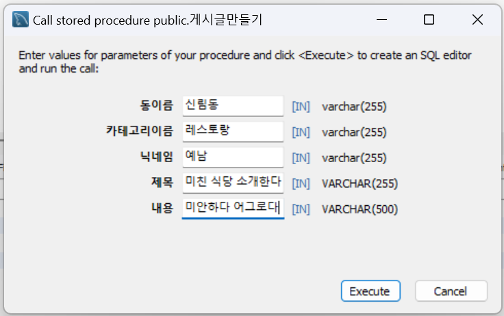

</details>

<details>
  <summary>우리그만만나</summary>

  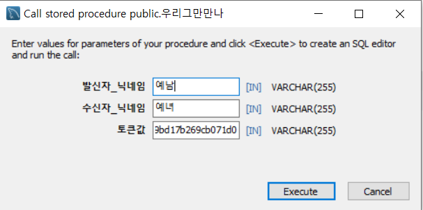

  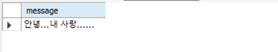

  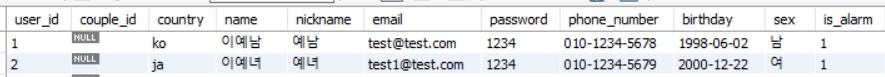

</details>

<details>
  <summary>우리다시만나</summary>

  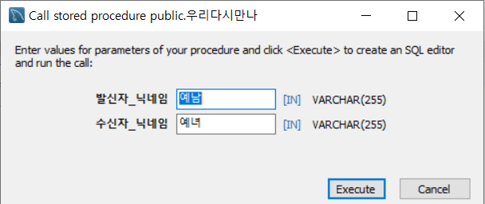

  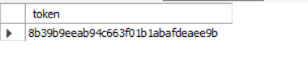

</details>

<details>
  <summary>회원탈퇴</summary>

  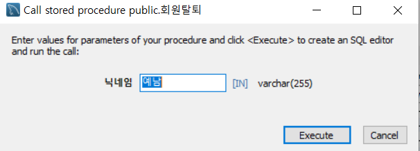
  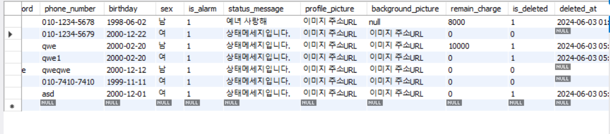

</details>

